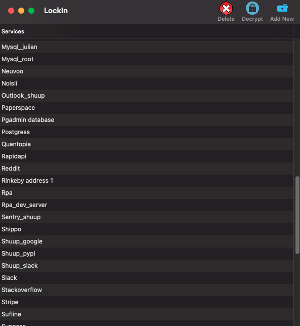
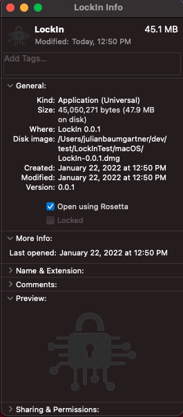

# LockIn
[](https://github.com/hyptocrypto/LockIn/actions/workflows/tests.yml)


**LockIn is a light-weight and encrypted password/credentials manager. The application implements EAR (encryption at rest) and is built as a cross platform native application using the [The BeeWare Project](https://beeware.org/). While only tested on macOS, the app should build on iOS, Windows, Linux and Android.**

<kbd>

</kbd>


## Install & Build
The only requirement for building LockIn locally is python3 & git. Then just clone the reop, cd in and run the install script. It will create a virtual environment to contain all the needed python packages. Once the app is complied into a disk image, it will launch the install and the repo can be deleted.

Clone Repo
```
git clone git@github.com:hyptocrypto/LockIn.git LockIn &&
cd LockIn &&
```
Install App
```
chmod + x install_app.sh &&
/bin/bash install_app.sh
```
Install CLI
```
chmod + x install_cli.sh &&
/bin/bash install_cli.sh
```

#### Troubleshooting
When trying to open the app, if you are met with the "User does not have permisson to run this application" error, try the following:
```
sudo chmod -R 777 /Applications/LockIn.app &&
sudo xattr -dr com.apple.quarantine /Applications/LockIn.app
```
If the app still will not open, try setting it to launch with Rosetta.

<kbd>

</kbd>


## Future development

- [X] Local NAS based database sync. Keep same db synced across multiple devices
- [ ] Configurable datastore options. Current default is an sqlite db sitting in the home dir of the user.
- [ ] UI updates and more keybindings. (Some of this will need to be done in the Toga GUI toolkit source code)

## License
The MIT License (MIT)

Copyright (c) 2022 Julian Baumgartner

Permission is hereby granted, free of charge, to any person obtaining a copy of this software and associated documentation files (the "Software"), to deal in the Software without restriction, including without limitation the rights to use, copy, modify, merge, publish, distribute, sublicense, and/or sell copies of the Software, and to permit persons to whom the Software is furnished to do so, subject to the following conditions:

The above copyright notice and this permission notice shall be included in all copies or substantial portions of the Software.

THE SOFTWARE IS PROVIDED "AS IS", WITHOUT WARRANTY OF ANY KIND, EXPRESS OR IMPLIED, INCLUDING BUT NOT LIMITED TO THE WARRANTIES OF MERCHANTABILITY, FITNESS FOR A PARTICULAR PURPOSE AND NONINFRINGEMENT. IN NO EVENT SHALL THE AUTHORS OR COPYRIGHT HOLDERS BE LIABLE FOR ANY CLAIM, DAMAGES OR OTHER LIABILITY, WHETHER IN AN ACTION OF CONTRACT, TORT OR OTHERWISE, ARISING FROM, OUT OF OR IN CONNECTION WITH THE SOFTWARE OR THE USE OR OTHER DEALINGS IN THE SOFTWARE.
